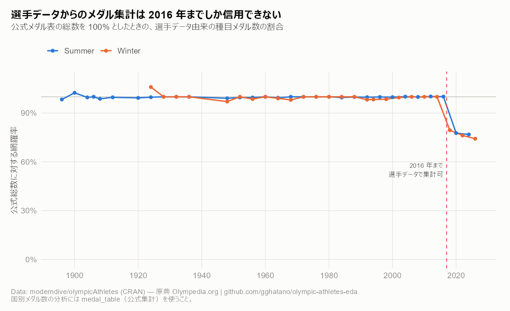

# データの癖

このデータで**何が言えて、何が言えないか**。

先に結論だけ言うと、`olympicAthletes` は年代によって性質が変わる。
全期間を一括で扱うと、実態ではなく**記録の整備状況**を分析してしまう。

| 分析対象 | 使える期間 | 理由 |
|---|---|---|
| 参加者数・性別 | **全期間** | `sex` は欠損ゼロ |
| 国別メダル数 | **全期間**（ただし `medal_table` を使う） | 公式集計は完全 |
| 選手データからのメダル集計 | **1896-2016** | 2018 年以降は 2〜3 割の種目が欠落 |
| 身長・体重・BMI | **1960-2016** | 両端で 4〜9 割が欠損 |
| 年齢 | 1960 年以降を推奨 | それ以前は最大 43% が欠損 |

以下はその根拠。

---

## 1. 大会の規模

1 大会あたりの「選手 × 種目」行数。1990 年代以降ほぼ横ばいなのは、
IOC が種目数と参加人数に上限を設けているため。
点線は中止された 1916 / 1940 / 1944 年大会で、選手データに行がない。

---

## 2. 身長・体重の欠損は 2018 年に逆戻りする

`height` / `weight` の欠損率は 1950 年代まで 7 割前後、1960 年代に 6% へ急落し、
**2018 年以降ふたたび 4〜7 割に戻る**。

| 大会 | height 欠損 | noc 欠損 |
|---|---:|---:|
| 2016 夏 | 1.3% | 0% |
| 2018 冬 | 3.8% | 6.7% |
| 2020 夏 | 44.7% | 9.5% |
| 2022 冬 | 41.5% | 7.1% |
| 2024 夏 | 65.7% | 10.4% |
| 2026 冬 | 63.2% | 7.2% |

全期間で「時代とともに選手が大型化した」と言うと、実際には
**記録が残った選手の偏りの変化**を見ていることになる。
そのため身体データの分析は **1960-2016 年** に固定している。

---

## 3. メダルも 2018 年以降は 2〜3 割足りない

選手データから種目単位に集計したメダル数を、公式 `medal_table` の総数と
突き合わせるとこうなる。

| 大会 | 選手データ由来 | 公式総数 | 網羅率 |
|---|---:|---:|---:|
| 1996 夏 | 841 | 842 | 99.9% |
| 2012 夏 | 962 | 960 | 100.2% |
| 2016 夏 | 973 | 972 | 100.1% |
| **2020 夏** | 839 | 1,080 | **77.7%** |
| **2024 夏** | 802 | 1,044 | **76.8%** |
| 2014 冬 | 295 | 295 | 100.0% |
| **2018 冬** | 244 | 307 | **79.5%** |
| **2026 冬** | 259 | 349 | **74.2%** |

### これは「種目ごと欠落」ではなく「メダル列だけ欠落」

2024 年パリ大会を分解すると:

- 選手データ中の種目数: **323**
- そのうちメダルが 1 つでも付いている種目: **249**
- 選手はいるがメダルが 0 の種目: **74**（ボート 12・競泳 7・陸上 6 など）

つまり**選手も種目も入っているのに、メダル列だけが埋まっていない**。
上流の取り込み漏れである可能性が高い（[分析候補の E-1](analysis-ideas.md)）。
もしそうなら上流の更新で解消し、2016 年で切る制約は外れる。

**そのため国別メダル数の分析には公式 `medal_table` だけを使っている。**

---

## 4. 集計時の落とし穴

実装上どう対処したかは [前処理の方針](preprocessing.md) に書いた。

### 4-1. `medal` の NA は「メダルなし」

86% が NA だが、これは欠損ではなく「入賞しなかった」を表す。
欠損として除外するとメダリストだけが残る。

### 4-2. 団体競技はメダル 1 個に選手行が人数分ある

1908 年の体操団体は、1 つの金メダルに 38 行が対応する。
選手行をそのまま数えると水増しになる。

> 2024 夏の USA は、メダルの付いた選手行が **195**。
> 種目単位に一意化すると **99**。

### 4-3. `(id, games, event)` の重複 1,480 行は多くが実在

芸術競技での複数作品出品、セーリングで同一選手が複数の艇に乗り
別々のメダルを獲得したケースなどを含む。重複キーの 8 割は 1948 年以前。
**安易に重複排除すると実データを壊す。**

### 4-4. 種目単位のメダル集計も公式と完全一致はしない

選手データが揃っている 1896-2016 の 51 大会で突き合わせると、
**平均 1.2 件、最大で +7 / −4 件**ずれる（1 大会あたり 0.1〜0.2%）。

- **過小**: 同一 NOC が同一種目で同色メダルを 2 つ獲得すると 1 件に潰れる
- **過大**: 同着や、公式表と種目の括り方が違うケース

比較の用途には十分だが、**メダル数そのものを示す図には使わない**。

### 4-5. 1 種目のメダルが 4 件になるのは正常

柔道・ボクシング・レスリング・テコンドーは銅を 2 個授与する。
2024 夏では 249 種目中 55 種目が該当。
2016 夏で確認したところ、1 種目あたりのメダル件数は 3 件か 4 件しかなく、
5 件以上になる種目は存在しない。

---

## 5. 夏と冬を混ぜない

これは欠損とは別だが、同じくらい間違えやすい。

冬季は参加国も種目数も夏季と桁が違う。合算すると:

- **メダルのシェア**: 分母が混ざって意味を失う。冬季だけで強い国が夏季の物量に埋もれる
- **時系列**: 1994 年以降は夏と冬が別の年に開催されるため、合算した折れ線は
  「夏の年」と「冬の年」を交互にプロットすることになる。
  実際これで、体格の推移図に**変化ではなく競技構成の違いによるギザギザ**が出ていた

本リポジトリではメダルと体格の図をすべて夏冬で分けている。

---

## 6. この文書の数値は自動検証している

ここと [README](../README.md)、[前処理の方針](preprocessing.md) に書いた固定の数値は、
`tests/check_claims.R` が実データと突き合わせて CI で検証している。
`olympicAthletes` は更新中のパッケージなので、上流がデータを足すと
本文だけが静かに古くなるため。詳細は [開発](engineering.md) を参照。
