<!--
YAML フロントマターは置かない。
knitr::knit() は YAML を素通しするため、生成された .md の先頭に
YAML が残り、GitHub 上で表として描画されてしまうため。
タイトルは下の見出しが持つ。詳細は reports/render.R を参照。
-->

# オリンピック選手データを読む

```{r setup, include=FALSE}
knitr::opts_chunk$set(
  echo = FALSE, message = FALSE, warning = FALSE,
  comment = "", collapse = TRUE
)
source("../R/setup.R")
source("../R/prepare_data.R")
suppressPackageStartupMessages({
  library(dplyr); library(tidyr); library(knitr)
})
fmt <- function(x) format(x, big.mark = ",")
```

近代オリンピック全大会（1896 アテネ 〜 2026 ミラノ・コルティナ）の
選手個票 `r fmt(nrow(athletes))` 行から見えたこと。

図は `analysis/` の各スクリプトが生成したもので、
本文中の数値はこのレポートを作り直すたびに再計算される。

> このデータには年代によって使える・使えない範囲がある。
> メダルは 2018 年以降、身長体重は 1950 年代以前と 2018 年以降が欠けている。
> 詳しくは **[データの癖](../docs/data-quality.md)** に分けて書いた。
> 以下の分析はすべてその制約の中で行っている。

---

## 1. 体格はメダルに効くのか

このデータで最も「わかっていないこと」に近い問いから始める。

競技ごとに体格が違うのは当たり前だが、**同じ競技の中で**背の高い選手が
勝ちやすいのかは自明ではない。素朴に比べると 2 つの理由で誤る。
陸上のメダリストが背が高く見えるのは背の高い種目（走高跳・砲丸投）の
メダリストが多いだけかもしれないし、選手は時代とともに大型化するので
メダリストの年代分布が違えば差が出る。

そこで身長を **種目 × 性別 × 年代** のセル内で標準化してから比べた。
「同じ種目・同じ性別・同じ年代で競った相手の中で、相対的にどうだったか」を見る。

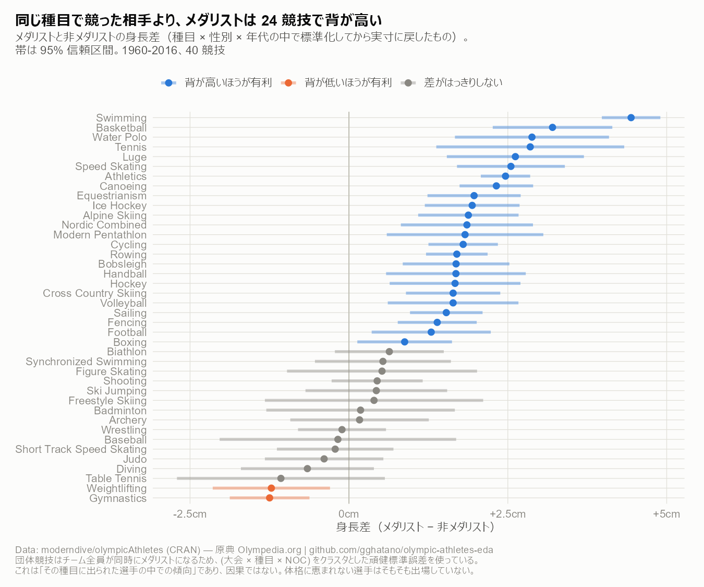

```{r gap-summary}
# 図と同じ手続きを再現して、本文の数値を毎回計算し直す
scored <- athletes |>
  filter(year >= BODY_YEARS[1], year <= BODY_YEARS[2],
         !is.na(height), !is.na(weight), !is.na(noc), bmi >= 13, bmi <= 45) |>
  group_by(event, sex, decade) |>
  filter(n() >= 20, sd(height) > 0, sd(weight) > 0) |>
  mutate(z_height = (height - mean(height)) / sd(height)) |>
  ungroup() |>
  mutate(cluster = paste(games, event, noc))

cr_diff <- function(y, medalist, cluster) {
  X <- cbind(1, as.numeric(medalist))
  XtX_inv <- solve(crossprod(X))
  beta <- XtX_inv %*% crossprod(X, y)
  resid <- as.vector(y - X %*% beta)
  meat <- matrix(0, 2, 2)
  for (idx in split(seq_along(y), cluster)) {
    s <- crossprod(X[idx, , drop = FALSE], resid[idx]); meat <- meat + tcrossprod(s)
  }
  G <- n_distinct(cluster); n <- length(y)
  V <- (G / (G - 1)) * ((n - 1) / (n - 2)) * XtX_inv %*% meat %*% XtX_inv
  c(est = beta[2], se = sqrt(V[2, 2]))
}

gaps <- scored |>
  group_by(sport) |>
  filter(n() >= 800, sum(is_medalist) >= 100) |>
  group_modify(~ {
    r <- cr_diff(.x$z_height, .x$is_medalist, .x$cluster)
    tibble(cm = unname(r["est"]) * sd(.x$height),
           se_cm = unname(r["se"]) * sd(.x$height))
  }) |>
  ungroup() |>
  mutate(sig = abs(cm / se_cm) > 1.96)

bind_rows(
  gaps |> filter(sig, cm > 0) |> slice_max(cm, n = 5),
  gaps |> filter(sig, cm < 0) |> slice_min(cm, n = 5)
) |>
  transmute(競技 = sport,
            `身長差` = sprintf("%+.1f cm", cm),
            `95%信頼区間` = sprintf("%+.1f 〜 %+.1f", cm - 1.96 * se_cm, cm + 1.96 * se_cm)) |>
  kable(align = "lrr")
```

`r sum(gaps$sig)` 競技で差がはっきり出た。うち高身長が有利なのが
`r sum(gaps$sig & gaps$cm > 0)` 競技、低身長が有利なのが
`r sum(gaps$sig & gaps$cm < 0)` 競技。

**競泳が突出している。** 同じ種目・同じ性別・同じ年代で競った相手より、
メダリストは平均 `r sprintf("%.1f", gaps$cm[gaps$sport == "Swimming"])` cm 背が高い。
水を捉える手足の長さがそのまま効く競技だと考えれば納得できる。
リュージュが上位に来るのも、重力で滑る競技だからだろう。

**逆を向くのは体操と重量挙げだけ**。どちらも身体を回す・持ち上げるために
テコの腕が短いほうが有利になる競技で、方向が一致している。

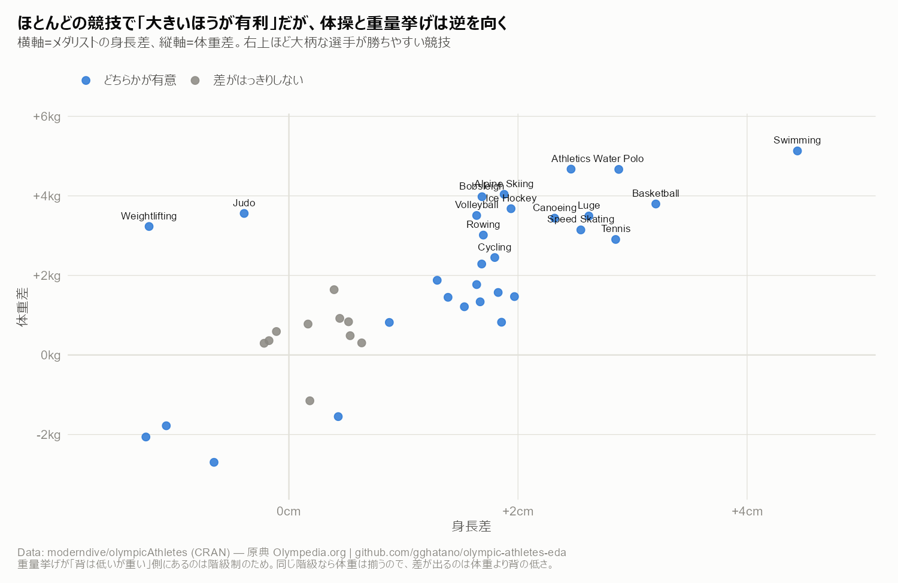

身長と体重を並べると、ほとんどの競技が右上（大きいほうが有利）に集まる。
重量挙げが「背は低いが重い」側に単独で位置するのは階級制のためで、
同じ階級なら体重は揃うので、差が出るのは体重より背の低さになる。

> **これは因果ではない。** 「その種目に出られた選手の中での傾向」でしかなく、
> 体格に恵まれない選手はそもそも五輪に来ていない。
> 団体競技はチーム全員が同時にメダリストになるため、
> (大会 × 種目 × NOC) をクラスタとした頑健標準誤差を使っている。

### 別の測り方でも結論は動かない — 大会の中で引き算する

上の図は種目 × 性別 × 年代のセル内で z 化するという、やや手の込んだ標準化を
経ている。もっと素朴なやり方でも同じ結論に届くかを確かめておく。

**同じ大会・同じ種目・同じ性別**の中だけで、メダリストの平均身長から
非メダリストの平均身長を引く。同じ年に競った相手との差なので、時代による
大型化はそのまま相殺される。同じ種目に閉じているので、種目構成の偏りも入らない。
こうして得た差の値（1 大会 1 種目 1 値）を競技ごとに集め、分布として見る。

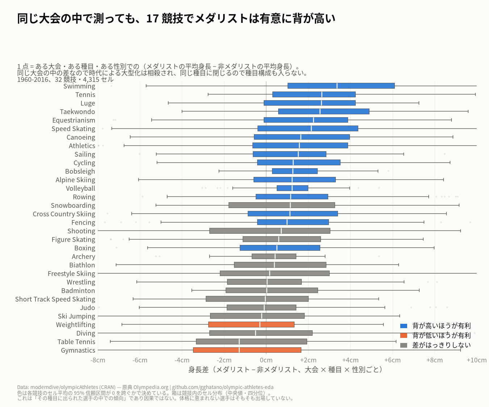

```{r yearly-gap}
# analysis/10_body_medalist_yearly.R と同じ手続きを再現する
body10 <- athletes |>
  filter(year >= BODY_YEARS[1], year <= BODY_YEARS[2],
         !is.na(height), height >= 120, height <= 230)

cells <- body10 |>
  group_by(sport, event, games, year, season, sex) |>
  summarise(n_med = sum(is_medalist), n_non = sum(!is_medalist),
            h_med = mean(height[is_medalist]), h_non = mean(height[!is_medalist]),
            .groups = "drop") |>
  filter(n_med >= 3, n_non >= 5) |>
  mutate(gap = h_med - h_non)

sport_cells <- cells |>
  group_by(sport) |>
  summarise(gap_median = median(gap), n_cells = n(), .groups = "drop") |>
  filter(n_cells >= 30)

# 有意性はセル平均の t 検定ではなく、選手行を単位にした固定効果回帰で。
# 身長を (大会 × 種目 × 性別) セル内で除去し is_medalist に回帰、選手 id でクラスタ。
fe_cluster_gap <- function(x) {
  x <- x |> group_by(cell) |>
    mutate(hy = height - mean(height), mx = m - mean(m)) |> ungroup()
  denom <- sum(x$mx^2); if (denom <= 0) return(tibble(est = NA_real_, se = NA_real_))
  beta <- sum(x$hy * x$mx) / denom; resid <- x$hy - beta * x$mx
  meat <- 0
  for (ix in split(seq_len(nrow(x)), x$id)) meat <- meat + sum(x$mx[ix] * resid[ix])^2
  G <- n_distinct(x$id); n <- nrow(x); k <- 1 + n_distinct(x$cell)
  adj <- (G / (G - 1)) * ((n - 1) / max(n - k, 1))
  tibble(est = beta, se = sqrt(adj * meat / denom^2))
}

sport_stats <- body10 |>
  semi_join(cells, by = c("sport", "event", "games", "year", "season", "sex")) |>
  semi_join(sport_cells, by = "sport") |>
  mutate(cell = paste(event, games, sex), m = as.numeric(is_medalist)) |>
  group_by(sport) |>
  group_modify(~ fe_cluster_gap(.x)) |>
  ungroup() |>
  left_join(sport_cells, by = "sport") |>
  mutate(lo = est - 1.96 * se, hi = est + 1.96 * se)

n_pos <- sum(sport_stats$lo > 0)
n_neg <- sum(sport_stats$hi < 0)
```

`r nrow(sport_stats)` 競技のうち、身長差の 95% 信頼区間が 0 の右に収まるのが
`r n_pos` 競技、左に収まるのが `r n_neg` 競技。順位も 1 章とそのまま重なり、
**競泳が中央値 `r sprintf("%+.1f", sport_stats$gap_median[sport_stats$sport == "Swimming"])` cm で突出**し、
逆に **体操が唯一はっきり負に振れる**（中央値 `r sprintf("%+.1f", sport_stats$gap_median[sport_stats$sport == "Gymnastics"])` cm）。
z 化という道具を使わなくても同じ地図が描けるということは、この差が
手続きの副産物ではなく、データに元から入っている構造だと示している。

> **有意性は素朴な t 検定では測れない。** 同じ選手が複数のセルに跨がる
> （メダリスト行の約半数が複数回メダルの選手）ため、セルは独立ではない。
> 身長を (大会 × 種目 × 性別) セル内で除去してから is_medalist に回帰し、
> 選手 id をクラスタとした頑健標準誤差で判定している。05 が団体競技の
> チーム相関を扱ったのと同じ発想を、選手の反復出場に当てたもの。

箱の縦の広がりにも意味がある。競泳やテニスは大会をまたいで安定して
プラス側に出るのに対し、射撃や体操はセルごとのばらつきが大きい。
点推定 1 個では見えなかった「差の安定度」が分布として読める。

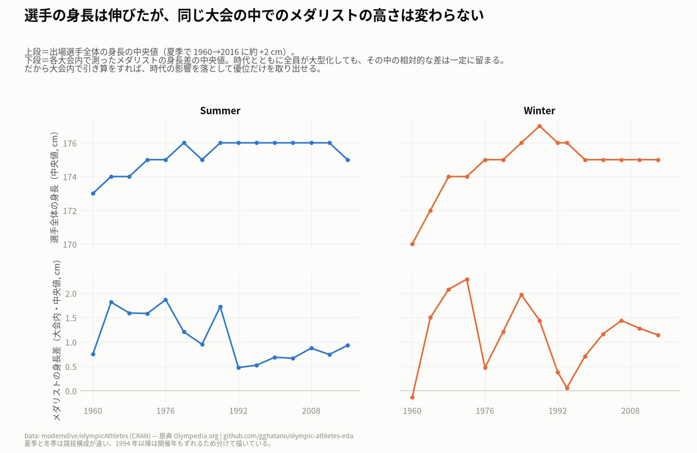

この引き算がなぜ時代を落とせるのかは、上の図が示している。**男女それぞれの**
身長は半世紀で 7cm 前後伸びているが（上段）、同じ大会の中で測ったメダリストの
差はほぼ一定に留まる（下段）。全員が大型化しても相対的な差は動かないので、
大会内で引けば時代の影響だけが消える。男女を混ぜると女子種目の増加で伸びが
相殺されて見えるため、性別で分けて描いている。

### 「体格」は身長か、それとも身長とは別の体格か

ここまで身長だけを見てきた。では「体重も効く」のか。素直に身長差と体重差を
並べると誤る。身長と体重は選手レベルで相関 0.8 と強く連動するので、
「体重も効く」の大半は「身長が効く」の言い換えになる。

そこで体重ではなく **BMI（体重 ÷ 身長²）** を第二の軸にする。BMI は身長で
割ってあるぶん身長と概ね独立（相関 0.34）で、「同じ身長での肉付き」を測る。

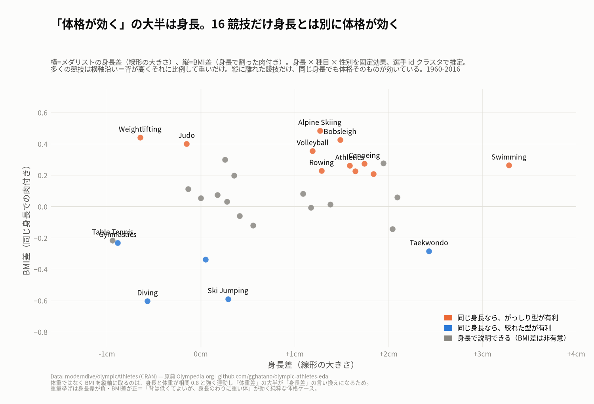

```{r size-build}
bb <- athletes |>
  filter(year >= BODY_YEARS[1], year <= BODY_YEARS[2], !is.na(height), !is.na(weight),
         height >= 120, height <= 230, bmi >= 13, bmi <= 45)
cell_ok <- bb |>
  group_by(sport, event, games, year, season, sex) |>
  summarise(n_med = sum(is_medalist), n_non = sum(!is_medalist), .groups = "drop") |>
  filter(n_med >= 3, n_non >= 5)
sport_cells <- cell_ok |> count(sport, name = "n_cells") |> filter(n_cells >= 30)
rows <- bb |>
  semi_join(cell_ok, by = c("sport","event","games","year","season","sex")) |>
  semi_join(sport_cells, by = "sport") |>
  mutate(cell = paste(event, games, sex), m = as.numeric(is_medalist))
fe <- function(x, col) {
  y <- x[[col]]; hy <- y - ave(y, x$cell); mx <- x$m - ave(x$m, x$cell)
  den <- sum(mx^2); if (den <= 0) return(c(NA, NA))
  b <- sum(hy * mx) / den; r <- hy - b * mx
  meat <- 0; for (ix in split(seq_len(nrow(x)), x$id)) meat <- meat + sum(mx[ix] * r[ix])^2
  G <- n_distinct(x$id); n <- nrow(x); k <- 1 + n_distinct(x$cell)
  c(b, sqrt((G/(G-1)) * ((n-1)/max(n-k,1)) * meat / den^2))
}
ss <- rows |> group_by(sport) |>
  group_modify(~ { h <- fe(.x,"height"); d <- fe(.x,"bmi")
    tibble(h=h[1], hse=h[2], b=d[1], bse=d[2]) }) |> ungroup() |>
  mutate(h_sig = (h-1.96*hse>0)|(h+1.96*hse<0), b_sig = (b-1.96*bse>0)|(b+1.96*bse<0))
n_h <- sum(ss$h_sig); n_bp <- sum(ss$b_sig & ss$b>0); n_bn <- sum(ss$b_sig & ss$b<0)
```

`r nrow(ss)` 競技のうち身長が有意なのは `r n_h` 競技。一方 BMI が身長とは別に
有意なのは `r n_bp + n_bn` 競技だけで、内訳は **がっしり型が有利 `r n_bp` 競技・
絞れた型が有利 `r n_bn` 競技**。図のほとんどの点が横軸沿いに並ぶ
（背が高く、それに比例して重いだけ）のはそのためで、**「体格が効く」の正体は
大半が線形の大きさ＝身長**だと分かる。

縦に離れる競技だけが、同じ身長でも体格そのものが効く。上側（同じ身長でも
重い体が有利）はボート・アルペン・ボブスレー・重量挙げなど力と重力の競技。
下側（同じ身長でも軽い体が有利）は飛込・スキージャンプ・体操など跳ぶ・回る・
飛ぶ競技。とりわけ **重量挙げは身長差が負・BMI差が正**——「背は低くてよいが、
身長のわりに重い体」が効く、純粋な体格ケースになっている。

#### 同じ階級制でも、打撃と組技は逆を向く

階級制の格闘技だけを拡大すると、この身長 × BMI 平面が競技の性格を映す。
**体重が階級で揃うと、残る自由度は「その体重をどう配るか＝身長」**になるからだ。

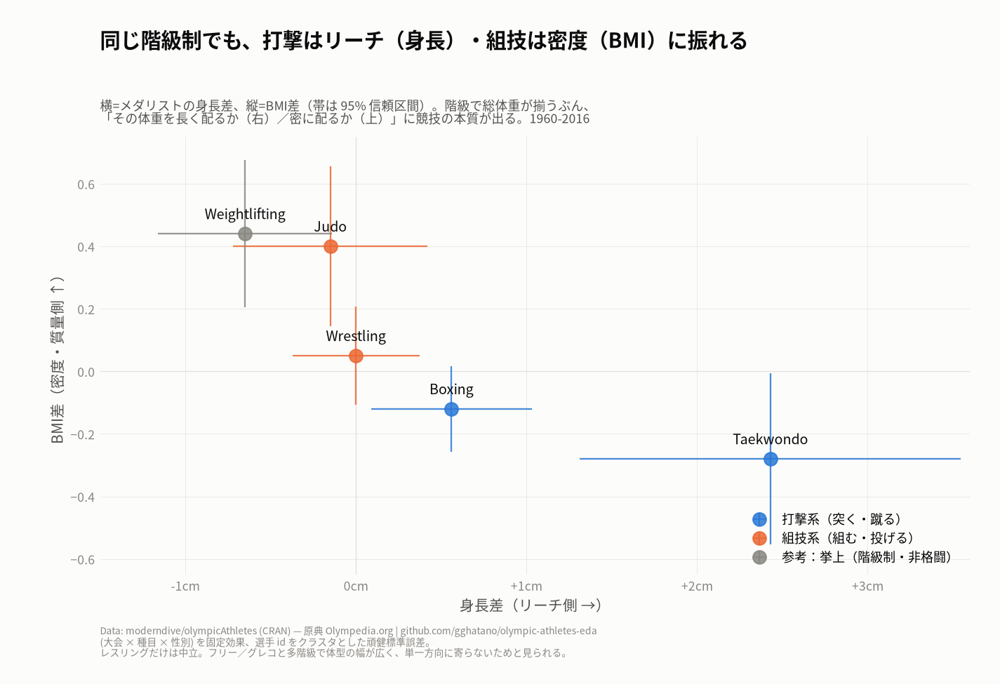

**打撃系（ボクシング・テコンドー）は右**——同じ体重なら長く配ったほうが、
突き・蹴りのリーチが伸びる。テコンドーはメダリストの身長差が全競技でも屈指の
大きさになる。一方 **組技系の柔道は上**——身長ではなく、同じ身長での密度（BMI）が
高いほうが組みと投げのテコになる。同じ体重別階級でも、打撃はリーチ、組技は密度、
と体型が逆を向く。

ただし **レスリングだけは中立**で、身長も BMI も効かない。フリー／グレコの 2 様式に
多くの階級が重なり、体型の幅が広くて単一方向に寄らないためと見られる。参考に置いた
重量挙げ（階級制だが非格闘）は左上——背は低く、身長のわりに密——で、密度側の極にある。

---

## 2. 競技は体格の平面上に並ぶ

前節が「競技の中」の話だったのに対し、こちらは「競技の間」の話。

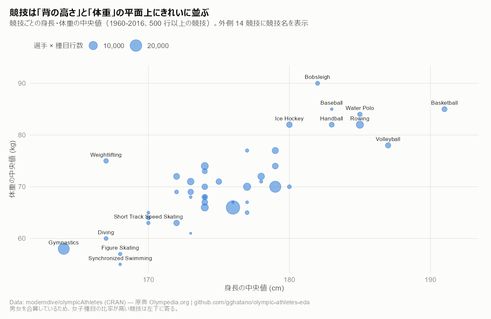

右上にバスケットボール・バレーボール・ボート・ボブスレー、
左下に体操・飛込・アーティスティックスイミング。
重量挙げだけが「背は低いが重い」領域に単独で位置する。

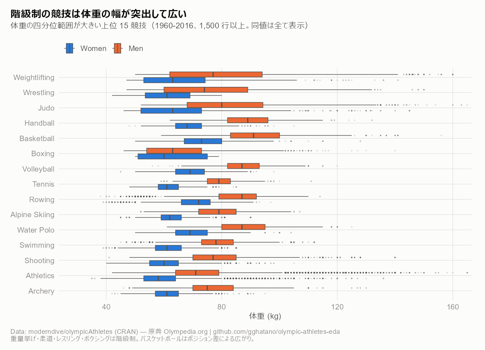

中央値だけでは「全員が大きい競技」と「大小が混在する競技」を区別できない。
階級制競技（重量挙げ・柔道・レスリング・ボクシング）は体重の幅が突出して広い。

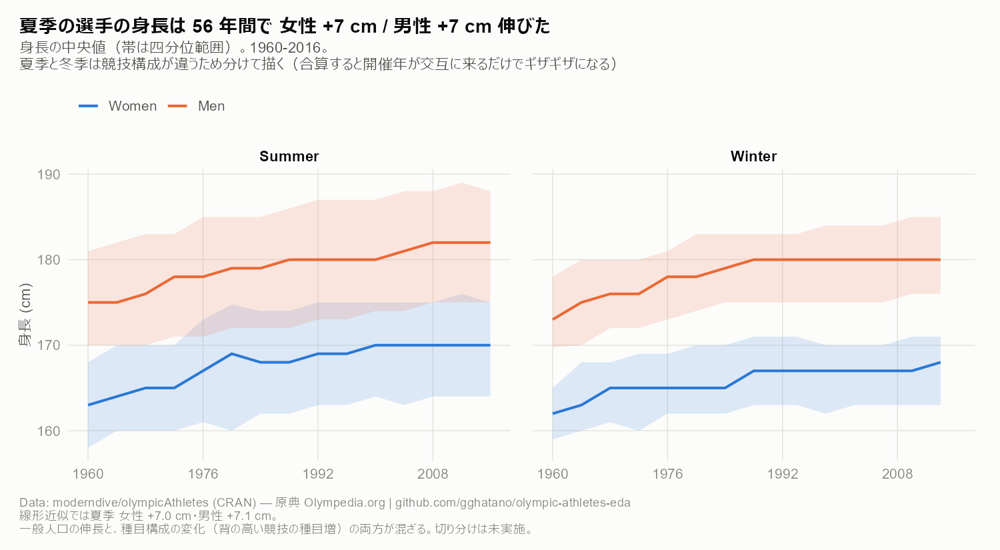

半世紀で男女とも 7cm 伸びている。一般人口の伸長と種目構成の変化
（背の高い競技の種目増）の両方が混ざっており、本レポートでは分離していない。

---

## 3. 冬季に全てを賭けている国

通算メダル数の順位表は夏季の物量に支配される。
冬季メダルは全体の 2 割弱しかないので、冬季だけで強い国は総合順位から見えない。

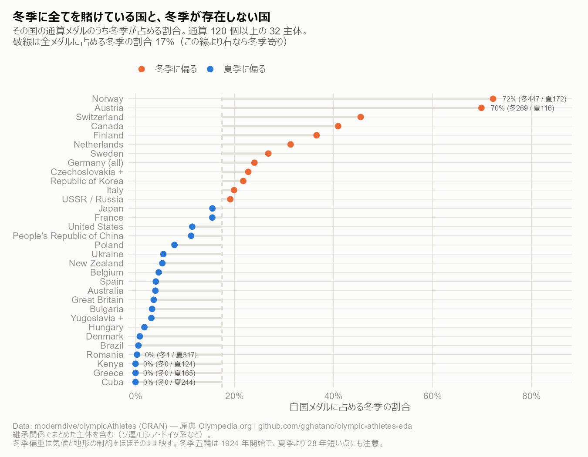

```{r season-specialists}
by_country <- medals_official |>
  mutate(entity = coalesce(lineage_label, country)) |>
  group_by(entity, season) |>
  summarise(medals = sum(total), .groups = "drop") |>
  pivot_wider(names_from = season, values_from = medals, values_fill = 0) |>
  mutate(total = Summer + Winter, winter_share = 100 * Winter / total) |>
  filter(total >= 120)

bind_rows(slice_max(by_country, winter_share, n = 4),
          slice_min(by_country, winter_share, n = 4)) |>
  transmute(主体 = entity, 夏季 = Summer, 冬季 = Winter,
            `冬季の割合` = sprintf("%.0f%%", winter_share)) |>
  kable(align = "lrrr", format.args = list(big.mark = ","))
```

ノルウェーは自国メダルの 7 割強が冬季。一方でキューバ・ギリシャ・ケニアは
冬季メダルが 1 つもない。気候と地形の制約がほぼそのまま出ている。

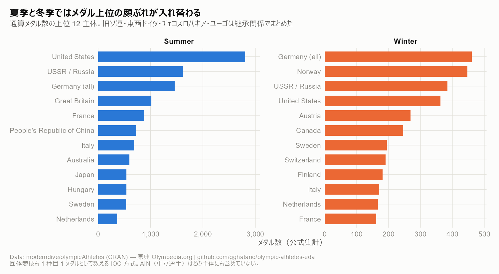

シーズンごとに順位表を分けると、顔ぶれが入れ替わる。

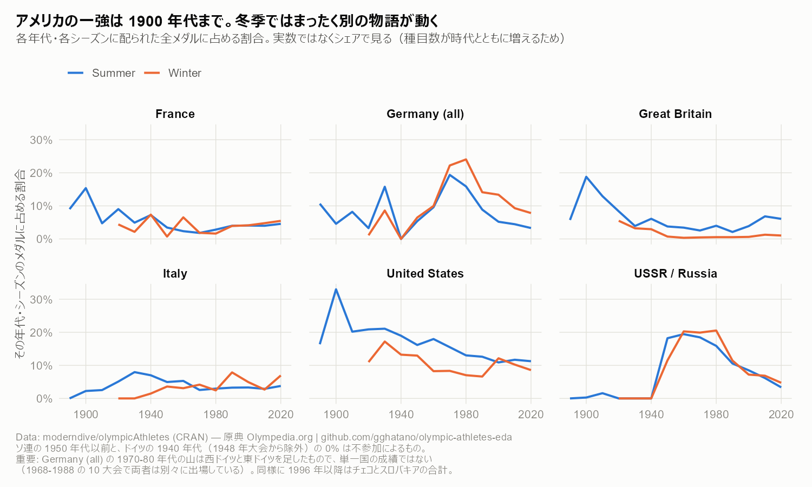

年代ごとのシェアも夏冬で別の物語が動く。実数ではなくシェアで見るのは、
種目数が時代とともに増えるため。

> Germany (all) の 1970-80 年代の山は、**西ドイツと東ドイツを足したもの**で
> 単一国の成績ではない（1968-1988 の 10 大会で両者は別々に出場している）。

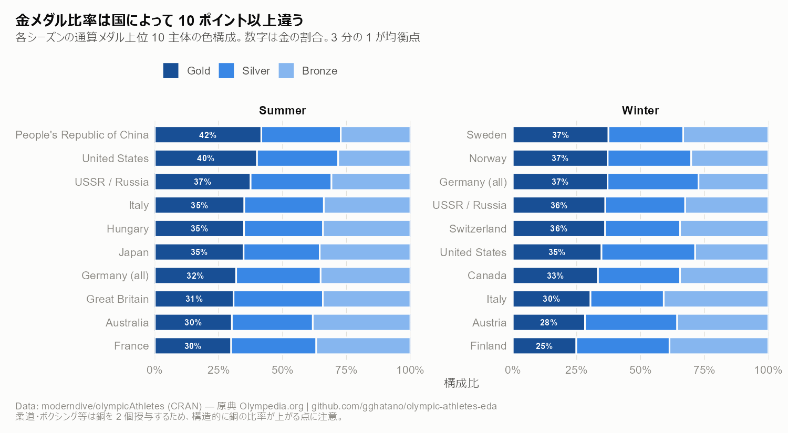

金メダルの比率には国によって 10 ポイント以上の差がある。

---

## 4. 開催国の特権を使い切ったのは誰か

開催国がメダルを増やすこと自体は驚きではない。
開催国には出場枠が自動的に与えられ、実施種目の選定にも関与できる。
面白いのは**その特権をどれだけ使い切ったか**の差のほうなので、
直近 30 年に絞って順位をつけた。

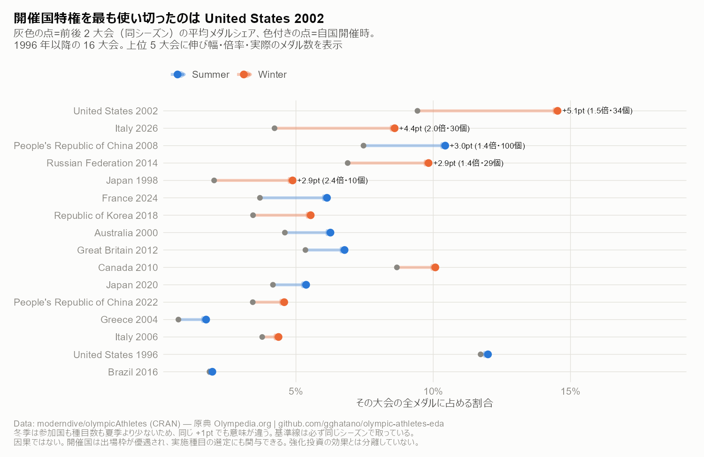

```{r host-top5}
edition_totals <- medals_official |>
  group_by(games, year, season) |>
  summarise(all_medals = sum(total), .groups = "drop")
shares <- medals_official |>
  left_join(edition_totals, by = c("games", "year", "season")) |>
  mutate(share = 100 * total / all_medals) |>
  select(noc, year, season, share, total)
he <- host_noc |>
  filter(!is.na(host_noc)) |>
  rowwise() |>
  mutate(
    home = {v <- shares$share[shares$noc == host_noc & shares$year == year &
                                shares$season == season]
            if (length(v) == 0) NA_real_ else v[1]},
    home_medals = {v <- shares$total[shares$noc == host_noc & shares$year == year &
                                       shares$season == season]
                   if (length(v) == 0) NA_integer_ else v[1]},
    baseline = {v <- shares$share[shares$noc == host_noc & shares$season == season &
                                    shares$year != year & abs(shares$year - year) <= 9]
                if (length(v) == 0) NA_real_ else mean(v)}
  ) |>
  ungroup() |>
  filter(!is.na(home), !is.na(baseline)) |>
  mutate(lift = home - baseline, ratio = home / baseline)

he |>
  filter(year >= 1996) |>
  slice_max(lift, n = 5) |>
  transmute(
    大会 = paste(host_country, year), シーズン = as.character(season),
    `前後大会の平均` = sprintf("%.1f%%", baseline),
    `自国開催時` = sprintf("%.1f%%", home),
    `伸び` = sprintf("%+.1f pt", lift),
    `倍率` = sprintf("%.1f倍", ratio),
    `獲得数` = home_medals
  ) |>
  kable(align = "llrrrrr")
```

**上位 5 大会のうち 4 つが冬季**。冬季は参加国も種目数も少ないぶん、
開催国が実施種目を厚くしたときの効き方が大きい。
長野 1998 の日本は 2.0% から 4.9% へ 2.4 倍に伸ばしている。

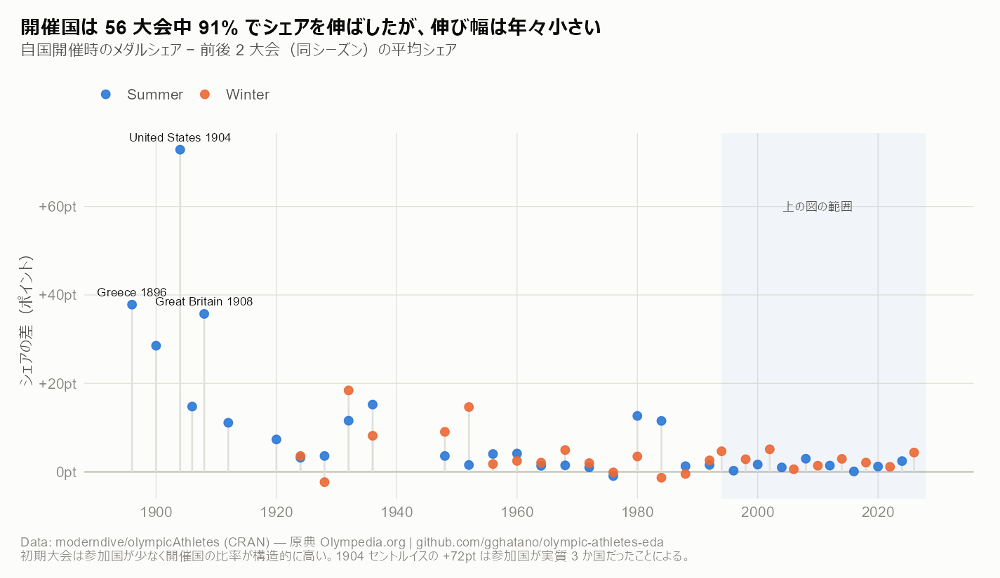

全期間で見ると、開催国が伸ばす確率は
`r sprintf("%.0f%%", 100 * mean(he$lift > 0))` と非常に高い一方、
伸び幅そのものは年々小さくなっている。初期大会は参加国が少なく、
開催国の比率が構造的に高かったため。

> 相関であって因果ではない。出場枠の優遇・強化投資・実施種目の選択が混ざっている。
> これを分解するのが今後の課題（[分析候補 A-5](../docs/analysis-ideas.md)）。

---

## 5. 五輪に何回出られるか

```{r careers}
careers <- athletes |>
  group_by(id) |>
  summarise(n_games = n_distinct(games), .groups = "drop")
```

選手の `r sprintf("%.0f%%", 100 * mean(careers$n_games == 1))` は
生涯に 1 度しか五輪に出ていない。5 大会以上出た選手は
`r fmt(sum(careers$n_games >= 5))` 人だけ。

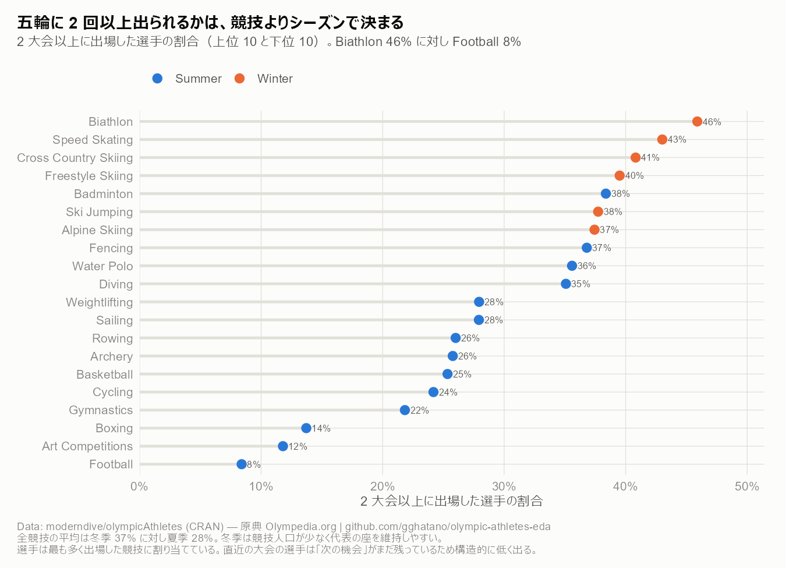

競技よりもシーズンで決まる。冬季競技は競技人口が少なく、
一度代表になると座を維持しやすい。


年齢の幅も競技で大きく違う。馬術・射撃・セーリングは
道具や馬の扱いが効くぶん選手寿命が長い。

---

## 6. 消えた競技、現れた競技

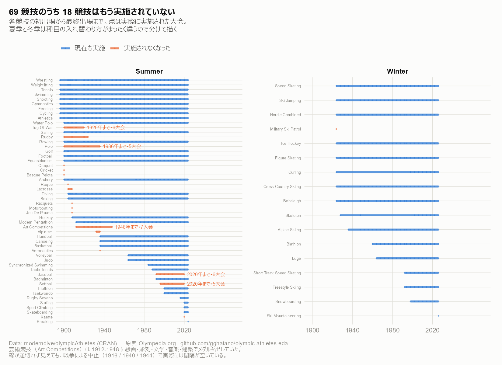

```{r sports-gone}
last_edition <- athletes |> group_by(season) |>
  summarise(last_year = max(year), .groups = "drop")
sport_years <- athletes |> distinct(sport, season, year) |>
  add_count(sport, season, name = "n_years") |>
  group_by(sport) |> filter(season == season[which.max(n_years)]) |> ungroup()
gone <- sport_years |>
  group_by(sport, season) |>
  summarise(first_year = min(year), final_year = max(year),
            n_editions = n_distinct(year), .groups = "drop") |>
  left_join(last_edition, by = "season") |>
  filter(final_year < last_year)

gone |> slice_max(n_editions, n = 6) |>
  transmute(競技 = sport, シーズン = as.character(season),
            期間 = paste0(first_year, "-", final_year),
            `実施大会数` = n_editions) |>
  kable(align = "llrr")
```

`r n_distinct(athletes$sport)` 競技のうち `r nrow(gone)` 競技はもう実施されていない。

**芸術競技**（1912-1948、7 大会）では絵画・彫刻・文学・音楽・建築に
メダルが出ていた。綱引きも 1900-1920 は正式競技だった。
野球とソフトボールは 2020 年東京で復活したが 2024 年でまた外れている。

一方でスケートボード・サーフィン・スポーツクライミング・ブレイキンは
2020 年代に入ってきたばかりで、線がまだ右端にしかない。

---

## 7. 女子種目を「足して」きた


```{r gender-milestones}
athletes |>
  filter(season == "Summer", year %in% c(1896, 1900, 1928, 1952, 1976, 1996, 2024)) |>
  group_by(年 = year) |>
  summarise(`行数` = fmt(n()),
            `女性の割合` = sprintf("%.1f%%", 100 * mean(sex == "Women")),
            .groups = "drop") |>
  kable(align = "lrr")
```

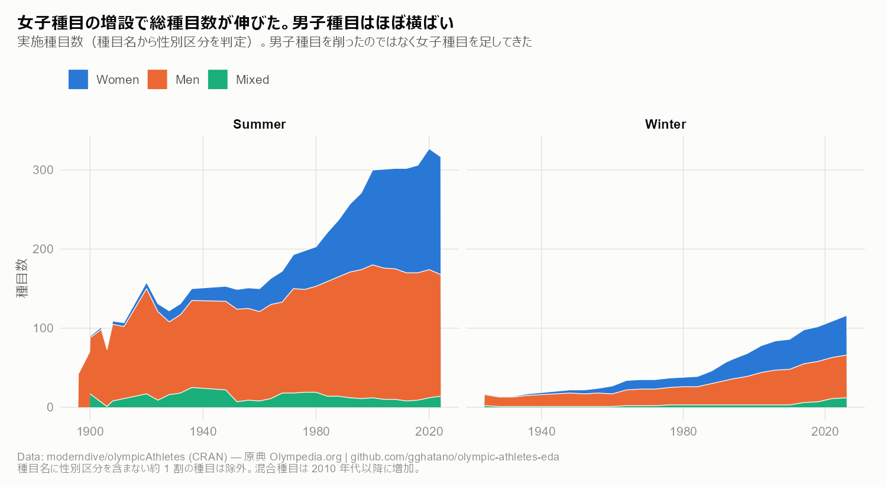

重要なのは、**男子種目を削ったのではなく女子種目を足してきた**こと。
男子種目数はほぼ横ばいのまま、総種目数が伸びている。

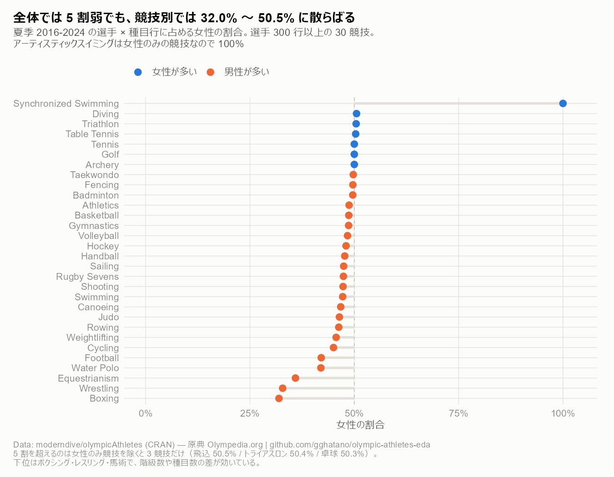

ただし競技単位ではまだ揃っていない。女性のみの競技を除くと、
女性比率が 5 割を超えるのは飛込・トライアスロン・卓球の 3 競技だけ。

---

## 8. 次に掘るべき問い

[分析候補](../docs/analysis-ideas.md) に 20 件を整理した。優先度が高いのは 3 つ。

1. **2018 年以降の選手個票の欠損は上流の取り込み漏れか**（`E-1`）。
   選手も種目も入っているのにメダル列だけが空なので、その可能性が高い。
   解消すれば 2016 年で切る制約が外れ、分析の射程が大きく広がる。
2. **開催国優位の分解**（`A-5`）。出場枠・強化投資・種目選定のどれが効いているか。
3. **種目内での体格と成績の関係をさらに詰める**（`C-1`）。
   本レポートの 1 章は「メダリストか否か」の 2 値だが、
   順位や記録まで見れば効き方の形が分かる。

```{r session, echo=TRUE}
sessionInfo()$R.version$version.string
packageVersion("olympicAthletes")
```
