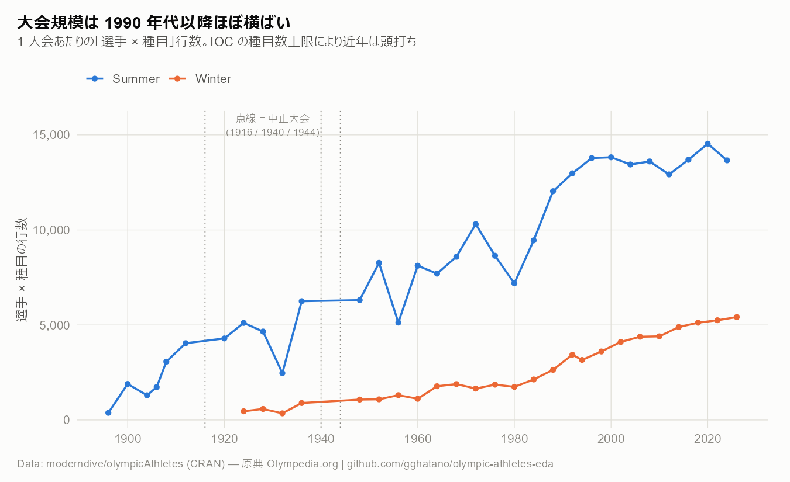
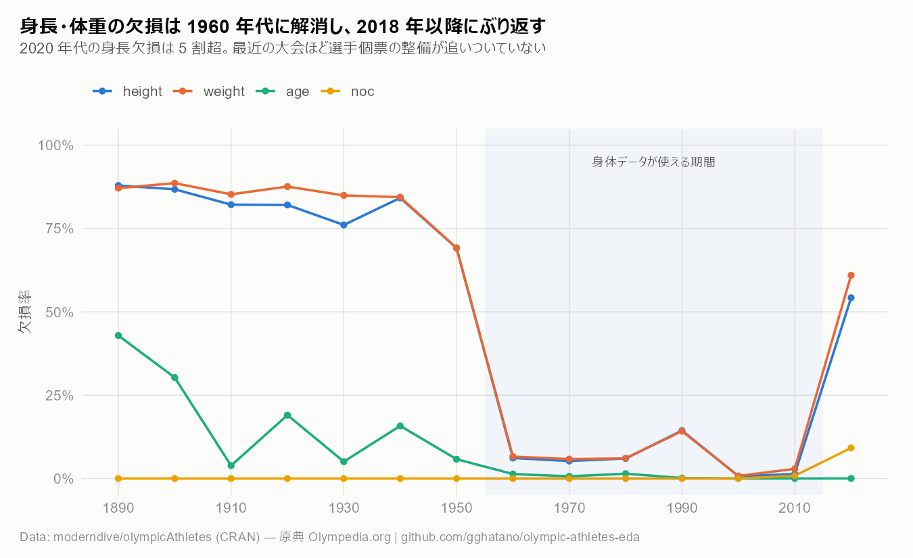
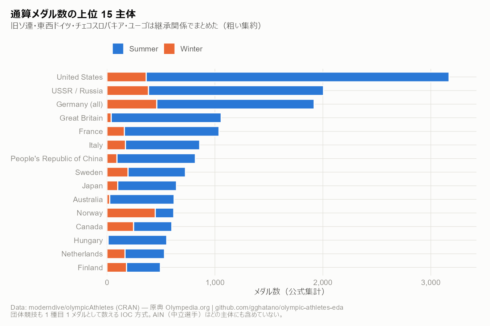
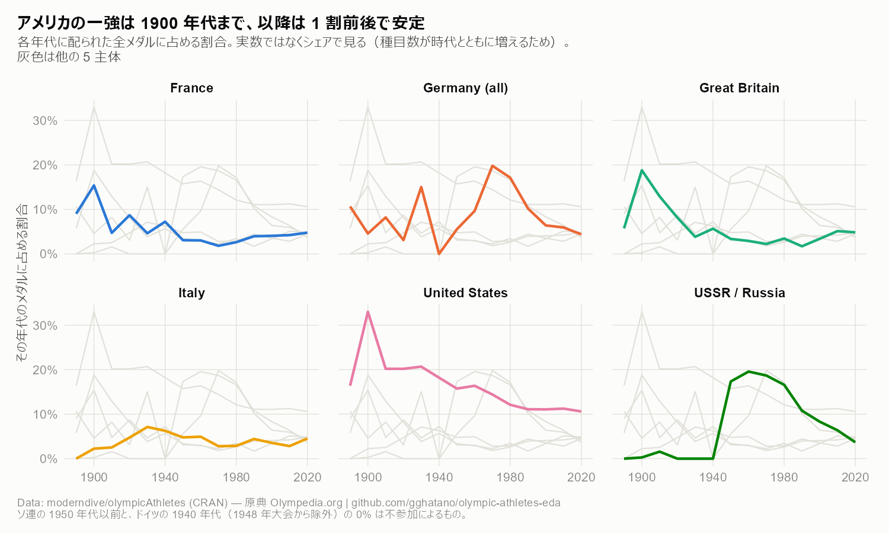
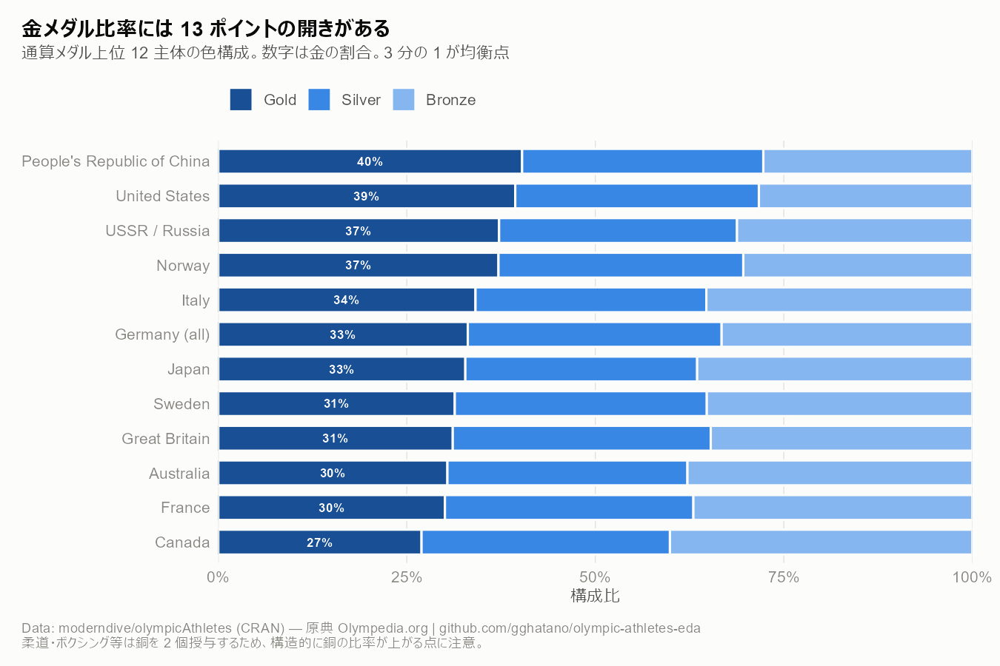
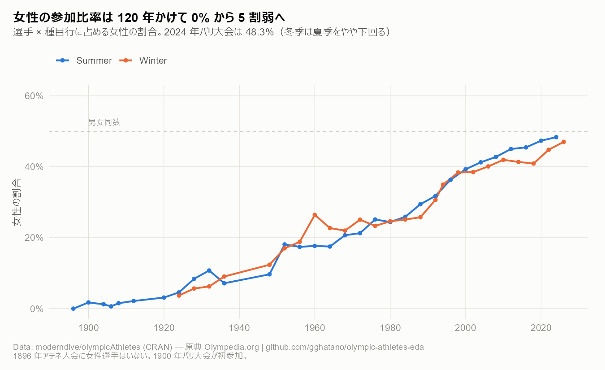
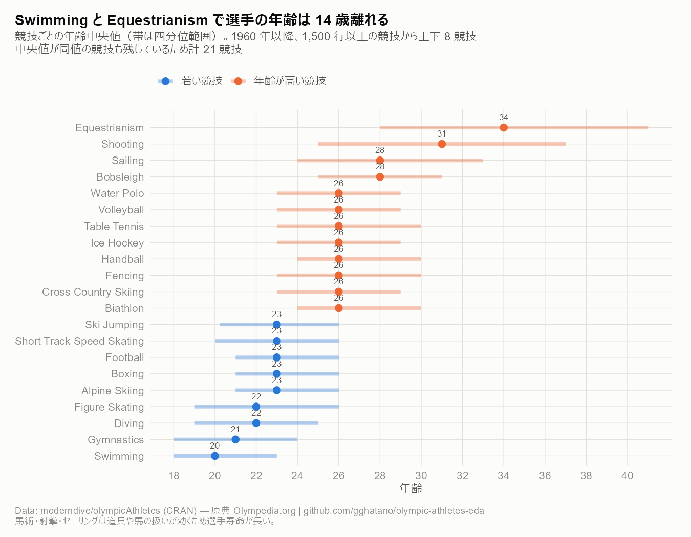
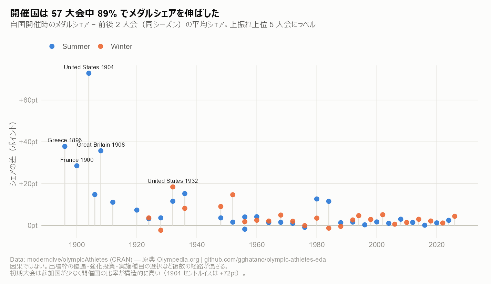
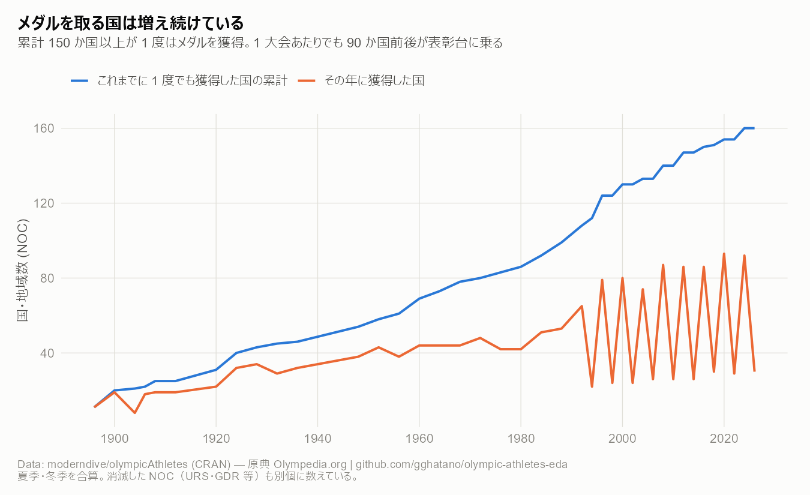

<!--
YAML フロントマターは置かない。
knitr::knit() は YAML を素通しするため、生成された .md の先頭に
YAML が残り、GitHub 上で表として描画されてしまうため。
タイトルは下の見出しが持つ。詳細は reports/render.R を参照。
-->

# olympicAthletes 探索的データ分析

```{r setup, include=FALSE}
knitr::opts_chunk$set(
  echo = FALSE, message = FALSE, warning = FALSE,
  comment = "", collapse = TRUE
)
source("../R/setup.R")
source("../R/prepare_data.R")
suppressPackageStartupMessages({
  library(dplyr); library(tidyr); library(knitr)
})
fmt <- function(x) format(x, big.mark = ",")
```

近代オリンピック全大会（1896 アテネ 〜 2026 ミラノ・コルティナ）の
選手個票データ `olympicAthletes` の探索的分析。

図は `analysis/` の各スクリプトが生成したもの。
本文中の数値はこのレポートを knit するたびに再計算される。

- データ辞書: [`docs/data-dictionary.md`](../docs/data-dictionary.md)
- 前処理の方針: [`docs/preprocessing.md`](../docs/preprocessing.md)
- 今後の分析候補: [`docs/analysis-ideas.md`](../docs/analysis-ideas.md)

---

## 1. データの全体像

```{r overview}
tibble::tibble(
  項目 = c("選手 × 種目の行数", "選手数 (id)", "大会数", "競技数", "種目数",
           "年代範囲（夏季）", "年代範囲（冬季）"),
  値 = c(
    fmt(nrow(athletes)),
    fmt(n_distinct(athletes$id)),
    fmt(n_distinct(athletes$games)),
    fmt(n_distinct(athletes$sport)),
    fmt(n_distinct(athletes$event)),
    paste(range(athletes$year[athletes$season == "Summer"]), collapse = " - "),
    paste(range(athletes$year[athletes$season == "Winter"]), collapse = " - ")
  )
) |> kable()
```

粒度は **1 行 = 1 人の選手が 1 大会の 1 種目に出場したこと**。
同じ選手が複数種目に出れば複数行、団体競技ならチーム全員分の行がある。



大会規模は 1990 年代に頭打ちになる。IOC が種目数と参加人数に上限を設けたため。
点線は中止された 1916 / 1940 / 1944 年大会。

---

## 2. このデータで何が言えないか

分析を始める前に、欠損の構造を確認する。ここが後の全ての制約になる。



`height` / `weight` の欠損率は 1950 年代まで 7 割前後、1960 年代に 6% へ急落し、
**2018 年以降ふたたび 4-7 割に戻る**。

```{r missing-recent}
athletes |>
  filter(year >= 2014) |>
  group_by(大会 = games) |>
  summarise(
    `行数` = fmt(n()),
    `height 欠損` = sprintf("%.1f%%", 100 * mean(is.na(height))),
    `noc 欠損` = sprintf("%.1f%%", 100 * mean(is.na(noc))),
    .groups = "drop"
  ) |>
  arrange(大会) |>
  kable(align = "lrrr")
```

メダルも同じ問題を持つ。選手データから種目単位に集計したメダル数を
公式 `medal_table` と突き合わせると、2018 年以降は 2〜3 割足りない。


```{r coverage}
event_medals |>
  count(games, year, name = "選手データ由来") |>
  left_join(
    medals_official |> group_by(games) |> summarise(公式総数 = sum(total), .groups = "drop"),
    by = "games"
  ) |>
  filter(year >= 2012) |>
  mutate(網羅率 = sprintf("%.1f%%", 100 * `選手データ由来` / 公式総数)) |>
  select(大会 = games, `選手データ由来`, 公式総数, 網羅率) |>
  kable(align = "lrrr")
```

**したがって本レポートでは:**

- 国別メダル数は公式 `medal_table` のみを使う
- 選手データからのメダル集計は **2016 年まで**
- 身体データの分析は **1960-2016 年** に限定する
- 参加・性別（`sex` は全期間で欠損ゼロ）は全期間で使える

---

## 3. 国とメダル



旧ソ連・東西ドイツ・チェコスロバキア・ユーゴスラビアは継承関係でまとめている
（粗い集約であることに注意）。



実数ではなくシェアで見る。種目数が時代とともに増えるため、実数では比較にならない。

アメリカのシェアは 1904 年セントルイス大会の 33% を頂点に下がり続け、
1990 年代以降は 1 割前後で安定している。
ソ連は 1950 年代の初参加から 20 年で 2 割に達し、崩壊とともに落ちた。

```{r era-numbers}
medals_official |>
  mutate(entity = coalesce(lineage_label, country)) |>
  group_by(entity) |>
  summarise(
    `金` = sum(gold), `銀` = sum(silver), `銅` = sum(bronze),
    `合計` = sum(total), .groups = "drop"
  ) |>
  slice_max(`合計`, n = 10) |>
  mutate(`金の割合` = sprintf("%.1f%%", 100 * `金` / `合計`)) |>
  rename(主体 = entity) |>
  kable(align = "lrrrrr", format.args = list(big.mark = ","))
```



金メダル比率には 10 ポイント近い差がある。ただし柔道・ボクシング等は
銅を 2 個授与するため、そうした競技に強い国は構造的に銅の比率が上がる。

---

## 4. 競技と性別



```{r gender-milestones}
athletes |>
  filter(season == "Summer", year %in% c(1896, 1900, 1928, 1952, 1976, 1996, 2024)) |>
  group_by(年 = year) |>
  summarise(
    `行数` = fmt(n()),
    `女性の割合` = sprintf("%.1f%%", 100 * mean(sex == "Women")),
    .groups = "drop"
  ) |>
  kable(align = "lrr")
```

1896 年アテネ大会に女性選手はいない。2024 年パリ大会で 48.3% に達した。


重要なのは、**男子種目を削ったのではなく女子種目を足してきた**こと。
男子種目数はほぼ横ばいのまま、総種目数が伸びている。


ただし競技単位で見るとまだ揃っていない。女性のみの競技
（アーティスティックスイミング）を除くと、女性比率が 5 割を超えるのは
飛込・トライアスロン・卓球の 3 競技だけで、いずれも 50.5% 以下。
下位はボクシング 32.0%、レスリング 32.8%、馬術 35.9% と 3 割台にとどまる。

---

## 5. 選手の身体

以下は **1960-2016 年**（`r fmt(nrow(filter(athletes, year >= 1960, year <= 2016, !is.na(height), !is.na(weight))))` 行）に限定した分析。


競技は身長・体重の平面上にきれいに並ぶ。
右上にバスケットボール・バレーボール・ボート・ボブスレー、
左下に体操・飛込・アーティスティックスイミング。
重量挙げだけが「背は低いが重い」領域に単独で位置する。


中央値だけでは「全員が大きい競技」と「大小が混在する競技」を区別できない。
階級制競技（重量挙げ・柔道・レスリング・ボクシング）は体重の幅が突出して広い。


半世紀で男女とも 4-5cm 伸びている。ただしこれは一般人口の伸長と
種目構成の変化（背の高い競技の種目増）が混ざったもので、本レポートでは分離していない。

---

## 6. 興味深い切り口



競泳（20 歳）と馬術（34 歳）で年齢中央値が 14 歳離れる。
馬術・射撃・セーリングは道具や馬の扱いが効くため選手寿命が長い。
逆に体操・飛込・競泳は 10 代後半から 20 代前半が中心。



```{r host}
edition_totals <- medals_official |>
  group_by(games, year, season) |>
  summarise(all_medals = sum(total), .groups = "drop")
shares <- medals_official |>
  left_join(edition_totals, by = c("games", "year", "season")) |>
  mutate(share = 100 * total / all_medals) |>
  select(noc, year, season, share)
he <- host_noc |>
  filter(!is.na(host_noc)) |>
  rowwise() |>
  mutate(
    home = {
      v <- shares$share[shares$noc == host_noc & shares$year == year & shares$season == season]
      if (length(v) == 0) NA_real_ else v[1]
    },
    baseline = {
      v <- shares$share[shares$noc == host_noc & shares$season == season &
                          shares$year != year & abs(shares$year - year) <= 9]
      if (length(v) == 0) NA_real_ else mean(v)
    }
  ) |>
  ungroup() |>
  filter(!is.na(home), !is.na(baseline)) |>
  mutate(lift = home - baseline)

tibble::tibble(
  項目 = c("比較できた大会数", "自国開催でシェアが上振れした割合",
           "上振れ幅の中央値", "1960 年以降に限った上振れ幅の中央値"),
  値 = c(
    as.character(nrow(he)),
    sprintf("%.0f%%", 100 * mean(he$lift > 0)),
    sprintf("%+.1f pt", median(he$lift)),
    sprintf("%+.1f pt", median(he$lift[he$year >= 1960]))
  )
) |> kable()
```

開催国はほぼ必ずメダルシェアを伸ばす。ただし初期大会は参加国が少なく
開催国の比率が構造的に高いため、幅は年代とともに小さくなる。
これは相関であって因果ではない（出場枠の優遇・強化投資・実施種目の選択が混ざる）。



メダルを取る国は増え続けている。

---

## 7. 次に掘るべき問い

[`docs/analysis-ideas.md`](../docs/analysis-ideas.md) に 20 件を整理した。
優先度が高いものを 3 つだけ挙げる。

1. **2018 年以降の選手個票の欠損は上流の取り込み漏れか**（`E-1`）。
   もし解消するなら、2016 年で切る制約が外れて分析の射程が大きく広がる。
2. **夏季に強い国・冬季に強い国**（`A-2`）。既存の前処理でそのまま書ける。
3. **同じ種目の中で体格は成績に効くか**（`C-1`）。
   このデータで最も「わかっていないこと」に近い問い。生存バイアスの扱いが鍵。

```{r session, echo=TRUE}
sessionInfo()$R.version$version.string
packageVersion("olympicAthletes")
```
